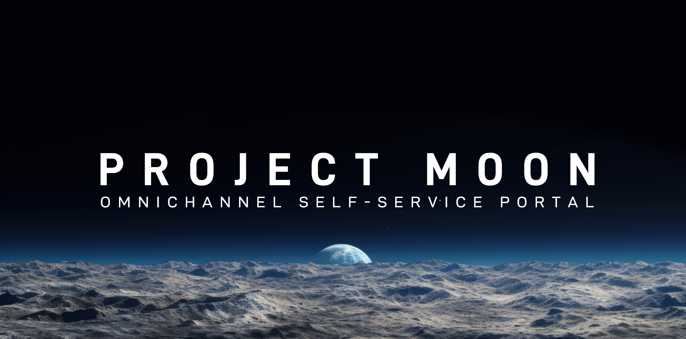

<div align="center">

# MOON Omnichannel Self‑Service Portal
**A modern, theme‑aware self‑service portal built with Astro, Tailwind CSS, DaisyUI, and ApexCharts. It includes a dashboard, authentication pages, system status, VPS listings and details, and a responsive layout with a left sidebar.**


[](https://github.com/withastro/astro/network/dependents)
[](LICENSE)


</div>
<br><br>

## Highlights
- Astro + Tailwind CSS + DaisyUI (light/dark via `data-theme`)
- Consistent UI with reusable card and spacer components
- Sidebar navigation with collapsible groups and active state
- Login + Forgot Password full‑screen pages with theme‑aware backgrounds
- Dashboard with tickets, system status, services/orders table with sort/filter, provider logos (light/dark variants)
- System Status page with ApexCharts, range + scenario toggles, Markdown bulletins
- VPS List + Details with sorting/filtering and ApexCharts metrics

<br><br>

## Getting Started

Prerequisites: Node.js 18+ (see `.nvmrc`), npm.

```bash
npm install
npm run dev
# open http://localhost:4321
```

Build and preview:
```bash
npm run build
npm run preview
```

To login just type what you want for username and password.

<br><br>

## Project Structure
```
├─ public/               
│  ├─ assets/
│  │  ├─ brand/           # Place here your logo in SVG light and dark
│  │  ├─ login/           # Login background
│  │  ├─ providers/       # Provider icons
│  │  └─ blog/            # Blog slider images
├─ src/
│  ├─ components/
│  │  ├─ Header.astro
│  │  ├─ Sidebar.astro
│  │  ├─ Footer.astro
│  │  ├─ Spacer.astro
│  │  └─ TopNotice.astro  # Global banner (dismissible)
│  ├─ layouts/
│  │  └─ BaseLayout.astro
│  ├─ pages/
│  │  ├─ dashboard/
│  │  ├─ login/
│  │  ├─ support/
│  │  └─ bare-metals/
│  ├─ styles/
│  │  └─ global.css
│  └─ content/
│     └─ status/          # Markdown bulletins used on System Status
├─ tailwind.config.mjs    # DaisyUI configured
├─ astro.config.mjs
├─ package.json
└─ LICENSE
```
<br><br>

## Theming
- DaisyUI themes (`light`/`dark`) driven by `data-theme` on `<html>`.
- Theme toggel lives in the avatar menu.
- Custom main background:
  - Light: `#f9f9f9`
  - Dark: `#1a2027`
- Provider logos auto-switch to `-light.svg` versions in dark mode; falls back to text if an SVG is missing.

<br><br>

## Global UI Conventions
- Card classes: `.app-card`, `.app-card-body`, `.app-card-title`
- Spacing helper: `<Spacer size={number} />`
- Rounding: 0.5rem globally (cards, inputs, badges)
- Sizes: Fields base 40px, selectors base 27px (see `global.css`)

<br><br>

## Top Notice (Collaboration Banner)
A global, dismissible notice appears below the header. Edit `src/components/TopNotice.astro` to customize text and link. The default points to the project repo:

- https://github.com/elelabdev/moon
- Dismiss state is saved in `localStorage` (`notice:dismissed`).
- To hide globally, remove it from `BaseLayout.astro` or gate by enviroment.

<br><br>


## ⭐ Contributing & Feedback

I welcome your ideas and feedbacks! Whether you discover a problem or have a feature request, please:

- **Open an issue**: https://github.com/elelabdev/moon/issues  
- **Suggest a new idea**: https://github.com/elelabdev/moon/discussions/categories/ideas
- **Ask questions and get answers**: https://github.com/elelabdev/moon/discussions/categories/q-a

Your insights help prioritize enhancements and ensure MOON scale as a very useful **Omnichannel Self-Service Portal**. Thank you for contributing!

<br><br>

## ❤️ Sponsor This Project
If you find MOON valuable, please consider sponsoring its ongoing development. Thank you for helping me building better open-source tools!  
<br>
[](https://github.com/sponsors/elelabdev) 